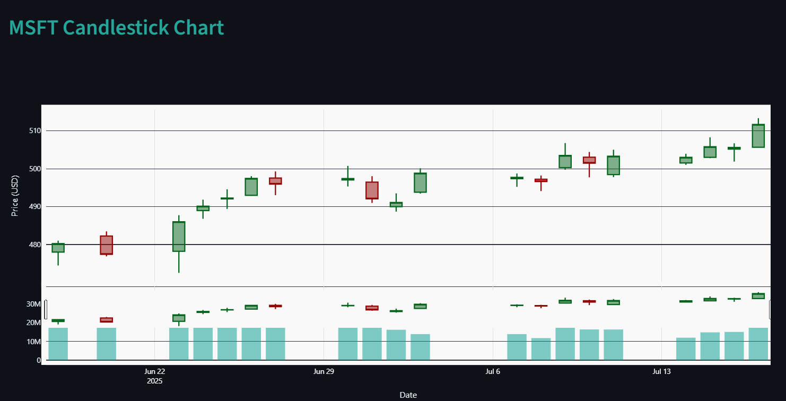
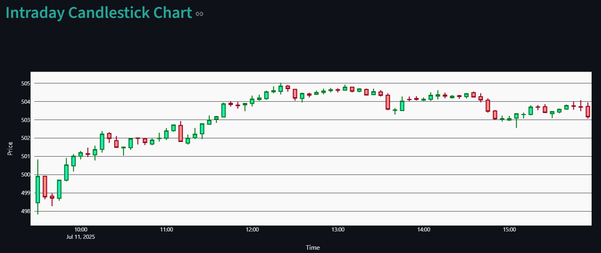
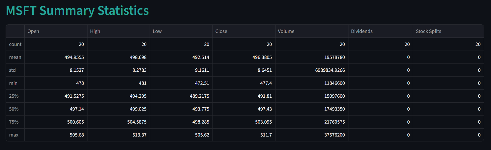

# Stock Analysis Dashboard

A professional, interactive dashboard for analyzing stocks with candlestick charts, intraday data, and summary statistics.  
Built with [Streamlit](https://streamlit.io/), [Plotly](https://plotly.com/python/), and [yfinance](https://github.com/ranaroussi/yfinance).

---

## 🚀 Features

- **Multi-page navigation** (Overview, Candlestick, Intraday, Statistics)
- **Interactive candlestick charts** with volume
- **Intraday analysis** with selectable dates
- **Summary statistics** for any ticker and period
- **Responsive, modern UI** with sidebar controls and custom color themes
- **Charts are locked** (no zoom or selection for clarity)
- **Professional layout** with logo, headers, and tooltips

---

## 📂 Project Structure

```
Stock Analysis Dashboard/
│
├── app.py
├── requirements.txt
└── pages/
    ├── Overview.py
    ├── Candlestick.py
    ├── Intraday.py
    └── Statistics.py
```

---

## 🛠️ Installation

1. **Clone the repository:**
    ```bash
    git clone https://github.com/yourusername/stock-analysis-dashboard.git
    cd stock-analysis-dashboard
    ```

2. **Install dependencies:**
    ```bash
    pip install -r requirements.txt
    ```

3. **Add your logo (optional):**
    - Place a `logo.png` file in the project root for branding.

---

## ▶️ Usage

Run the dashboard with:

```bash
streamlit run app.py
```

- Use the sidebar to navigate between pages and control chart options.
- Enter any valid stock ticker (e.g., `MSFT`, `AAPL`, `GOOGL`).

---

## 📊 Example Screenshots

| Candlestick Chart | Intraday Chart | Statistics |
|-------------------|----------------|------------|
|  |  |  |

---

## ✨ Customization

- **Theme:** Easily adjust colors and fonts in each page file.
- **Pages:** Add new `.py` files to the `pages/` directory for more features.
- **Data:** Uses [yfinance](https://github.com/ranaroussi/yfinance) for reliable stock data.

---

## 📄 License

MIT License.  
See [LICENSE](LICENSE) for details.

---

## 🙏 Acknowledgements

- [Streamlit](https://streamlit.io/)
- [Plotly](https://plotly.com/python/)
- [yfinance](https://github.com/ranaroussi/yfinance)

---

> **Made with ❤️ for data-driven investors and
